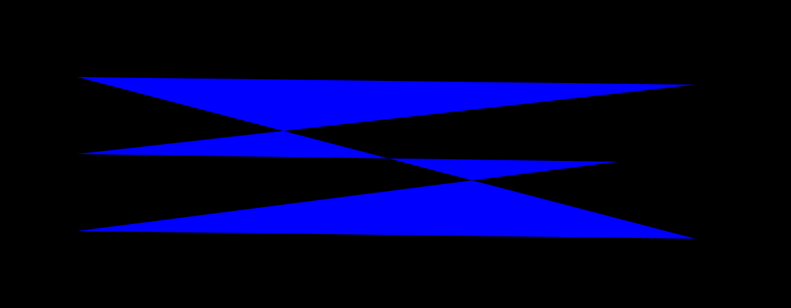

Filling shapes in Synfig
==========================
Synfig uses the `Contour` class for representing the outline of a any shape. The
outline can consist of:
1. Straight edges.
2. Cubic bezier curves.
3. Conic curves.

The api of the class is straight-forward, mimicing the movement of a pencil. It
mainly consists of:
```C++
class Contour {
public:
	void move_to(const Vector &v);
	void line_to(const Vector &v);
	void conic_to(const Vector &v, const Vector &pp0);
	void cubic_to(const Vector &v, const Vector &pp0, const Vector &pp1);
	void close();
};
```
Using these functions, the contour builds a list of 'chunks', with the types of
chunks being:
```C++
enum ChunkType {
    CLOSE,
    MOVE,
    LINE,
    CONIC,
    CUBIC
};
```
which closely matches the calls to the class methods. Using these chunks, Synfig
builds a data structure called a `Polyspan`. The polyspan represents most (if
not all) of the points requried to draw the perimeter of the shape. These points
are then sorted by their `y` coordinate, and by the `x` coordinate for points with
equal `y`s. This effectively sorts the points into scanlines. For each scanline
we fill between every two consecutive points if they follow the filling rule
followed. To read more about filling rules, see: [Nonzero rule][1] and [Even-odd rule][2].

The output of the example program is:


[1]: https://en.wikipedia.org/wiki/Nonzero-rule
[2]: https://en.wikipedia.org/wiki/Even%E2%80%93odd_rule
